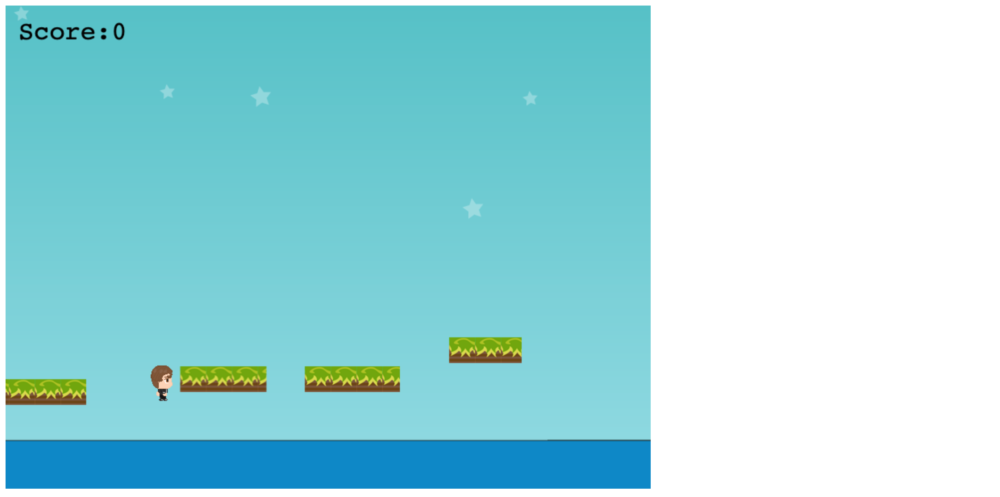

# Wild Escape
<p align="center">
    
</p>


Endless runner game made using phaser.io 

Build in 7 days. I've supposed to build it in 5 days, I've been robbed I lost my mobile wifi and my laptop but this obstacle won't stop me finish the game. In the first 2 days, I started learning phaser and arcade physics. Then I started designing the game logic. The idea was to make an endless runner game where you the player are trying to escape for something.

While you're escaping you need avoiding obstacle by jumping, collect some jewelry the score is based on the position you catch the Jewell. On the fourth day I started programming the game in the afternoon I've been robbed. Now I've only one day to submit the game I could send an email to microverse telling them that I want to stop to the capstone project because of the situation. Nope, I decided to challenge myself I get another computer then I start working on Monday. My initial objectives were to create an endless runner like Temple run 2D, unfortunately, I didn't complete my objectives.

### You can test the live version of the app here:
 https://wildescape.netlify.app/ 

### Scene Currently available:

* Loading screen
* Option screen
* Title Scene
* Help Scene
* Game scene
* leaderboard
* Title screen

### How to play:

* Left click on screen or space bare to jump
* Collect Jewell
* Don't fail

### Tech used:

* Javascript
* Phaser.io
* Webpack
* Html5
* Css

### External library:
* Axios
* phaser3-rex-plugins

## Using the app in development 
Clone this repo (you need Node js installed in your computer).
```
$ git clone git@github.com:certilremy/wild_escape.git
```

Change to the app directory 
 
 ```
$ cd wild_escape
 ```

   And run 

```
$ npm install 
```

To run the app in develop mode

```
$ npm run dev
```


To build for production

```
$ npm run build
```

To run the tests

```
$ npm run test
```

## Authors

* Certil Remy    Github : https://github.com/certilremy

## Contribution 

If you want to contribute to this project you're welcome .
Follow the github code of conduct fork this repo and open your pull request. 